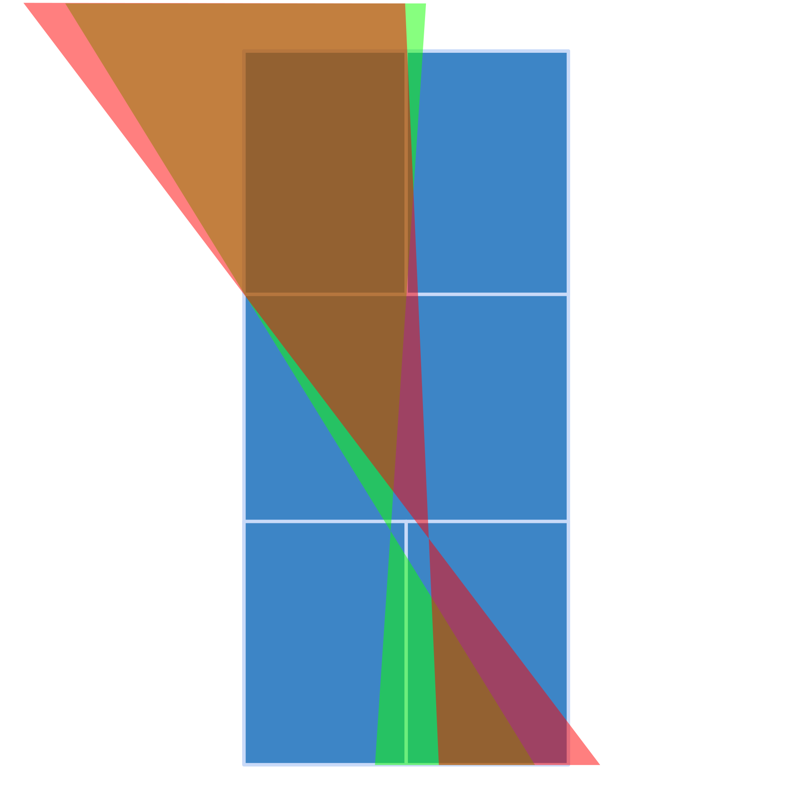

# Why The 2025 Provisional Rally Scoring Pickleball Rules Are Biased Towards Right Side Serving (And Why This Is Probably Unfair)

One of the players in our pickleball group recently mentioned the new rally scoring rules. He was referring to the provisional rally scoring rules for doubles as [introduced](https://usapickleball.org/docs/2025-USA-Pickleball-Rulebook-Change-Document.pdf) in the [2025 USA Pickleball Rulebook](https://usapickleball.org/docs/2025-USA-Pickleball-Rulebook.pdf).

During our weekly play, we tried things out and reread the rules a couple of times. Our conclusion: there is something odd about the "forced" right side serving after a side out. This causes every round of serving to start on the right side, which leads to significantly more right side serves than left side serves.

A couple of days later, I realized that it should be possible to prove this point by running a pickleball scoring simulator. The winner of every point is decided by a coin-flip-like mechanism, leading to a 50/50 chance for both teams to win every point. Within a couple of seconds, the simulator can play a million points, while keeping track of the number of left side and right side serves for all four players.

After some hours of coding and writing, here we are with an in-depth article on pickleball scoring rules. Let's go!

## Article overview

First, the simulator setup is explained. This setup is then used to show the differences between two types of doubles scoring:

1. **Traditional scoring**: the official (non-provisional) 2025 scoring rules
2. **Rally scoring**: the provisional 2025 rally scoring rules

Given these results, the article examines why the 2025 provisional rally scoring rules could be problematic.
To take these problems away, an alternative rally scoring approach is offered, followed by a couple of discussion points.

## Simulator setup

In the simulator, team `a` plays against team `b`. Both teams have players `1` and `2`. Player `1` of each team starts the game on the right side of the court (given all players are facing towards the net).

This gives us the following starting position:

```
   -------------
  |  a1  |  a2  |
  |      |      |
  |      |      |
  |-------------|
  |             |
-------------------
  |             |
  |-------------|
  |      |      |
  |      |      |
  |  b2  |  b1  |
   -------------
```

For each player, the simulator counts the number of serves, split into the side of the court from which is served.

The starting situation is then as follows:

|     |a1|a2|b1|b2|
|-----|-:|-:|-:|-:|
|right| 0| 0| 0| 0|
|left | 0| 0| 0| 0|

Player `a1` always starts with the first serve from the right side. The count thus changes:

|     |a1|a2|b1|b2|
|-----|-:|-:|-:|-:|
|right| 1| 0| 0| 0|
|left | 0| 0| 0| 0|

After that, the next server and their position on the court are determined by:

1. who wins the point (serving or receiving team, randomly selected with both 50% chance), and
2. the scoring rules for the current simulation.

For every serve played, the serve count is incremented for the corresponding player and side.

See [simulator.exs](./simulator.exs) for full source code and instructions on how to run the script. The script is written in Elixir, simply because this is the programming language I currenly use most.

## Simulation results

### Traditional scoring (2025 rulebook)

First, let's see how traditional scoring performs in terms of left/right serving.

After playing one million serves, the simulator will show serve counts roughly equivalent to this:

|     |a1    |a2    |b1    |b2    |
|-----|-----:|-----:|-----:|-----:|
|right|138948|138994|138883|138589|
|left |111415|111020|111192|110959|

Note that the exact numbers vary between simulations. This is due to the deliberately introduced randomness for individual rally wins.

What can be seen is that for every five right side services, there are four left side services.

While it could be fun to prove this mathematically, this is out of scope of this article.

In short, this makes sense, as every service turn starts on the right side. The second server guarantees that there will always be at least one left side service. In the long run, however, serving teams will score 50% odd and 50% even numbers of points on their service. Every time an odd number of points is scored, the team will have one right side service more than they have left side services, thus leading to a minor right side serving bias.

### Rally point scoring (2025 provisional rules)

Now, let's see how the 2025 rally point scoring rules performs.

After simulating one million serves, a typical result will look like this:

|     |a1    |a2    |b1    |b2    |
|-----|-----:|-----:|-----:|-----:|
|right|166736|166573|166543|166285|
|left | 83522| 83359| 83620| 83362|

Now there are two right side services for every left side service.

This is quite different to traditional scoring.

Again, this can be explained. As in traditional scoring, every service turn is started on the right side of the court. The odd/even scoring position alignment after a side out guarantees that both players serve in turn. This is reflected in the simulator results. However, this also causes a major right side serving bias, as there is no longer a second server that guarantees at least one left side service on each team's service turn.

In an extreme situation where all points are won by the receiving team, no player would ever serve from the left side of the court. While this will almost never be the case, this scenario clearly illustrates the right side serving bias caused by the 2025 provisional rally scoring rules.

## Why is right side serving bias a problem?

Before turning to a proposed solution, first we should ask ourselves: why is right side serving bias a problem?

Serving side bias wouldn't be problematic if all pickleball players would be right-handed. (Or all left-handed, for that matter.)

Then all servers would be able to make the same angles, as their hand positions would be the same.

In practice, this is not the case, as about 10% of the population is left-handed.

For a left-handed player, serving from the right side of the court makes if harder to make sharp angles towards the outside of the court. While serving, both feet must be inside the service area, of which the boundary also includes the imaginary sideline extension behind the baseline. Right-handed servers can extend their playing hand outside the court, which left-handed servers cannot do due to their mirrored body position.

This is partly compensated by having the possibility to hit the ball further inside the court on the other side of the service area, but not completely. This is best made clear by a visual representation:

<hr/>

<figure>
  
  <figcaption>Serving angles from right side of the court. Red: right hand. Green: left hand. A hit point two feet outside of the body is assumed.</figcaption>
</figure>

<hr/>

At the time of writing, I do not have any data on _how_ this affects play. All I can say at this point is that there is a clear difference in serving angles depending on playing hand. I am assuming this will affect play.

Ensuring an equal number of right and left side services would compensate for this, as the serving angles are then mirrored and swapped. The official rules (both traditional scoring and rally scoring) should therefore aim to minimize the difference between the number of right and left side service turns.

### Proposal: rally scoring without right side bias

So given there is a problem, how can we fix it? By using our simulator!

All we have to do is implement a slightly different set of rally scoring rules. Buy what should be changed to ensure an equal number of right and left side serves?

The proposal in this article is to use the serving side rules from singles scoring. The following rules apply after every side out:

- If the serving team's score is even, start serving from the right side
- If the serving team's score is odd, start serving from the left side

After the serving team wins the point, players switch positions (which is aleady the case in all 2025 rulebook scoring variations).

Running one million serves in the simulator gives the following results:

|     |a1    |a2    |b1    |b2    |
|-----|-----:|-----:|-----:|-----:|
|right|124733|125104|124929|125234|
|left |125003|124833|125497|124667|

As can be seen, now there are equal numbers of right side and left side services.

Problem solved! Or not?

## Discussion

So why is this format not used in the 2025 provisional rules?

Reading a bit of [discussion on Facebook](https://www.facebook.com/groups/1340630926008388/posts/27974748598836592/), it seems that USA Pickleball has also been taking referees into account. In traditional scoring, a referee can tell from a team's odd or even score which player should be serving and receiving on which side of the court. This is why in tournaments, the starting server and receiver often need to wear a wristband, as they should be on the right side when scores are even.

The 2025 provisional rally scoring rules make sure this is still possible. This comes at the cost of a more severe right side serving bias.

The proposed rally scoring alternative takes away right side serving bias. Now at the cost of no longer being able to instantly spot from the scoreboard which player should serve or receive on which side of the court.

This leaves the question: what is more important?

Let me know your thoughts!

## About the author

Floris Huetink is the founder of Pickleball Amersfoort, a local pickleball community in the Netherlands. When he is not playing pickleball, he sometimes creates software in exchange for money and/or fun.
